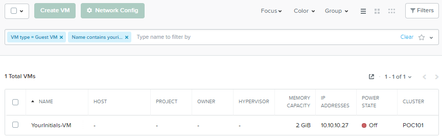
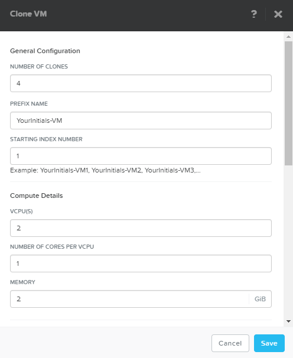
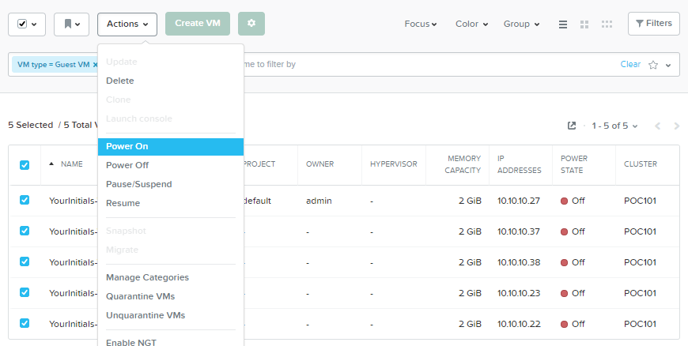
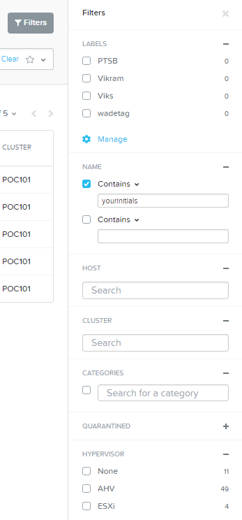
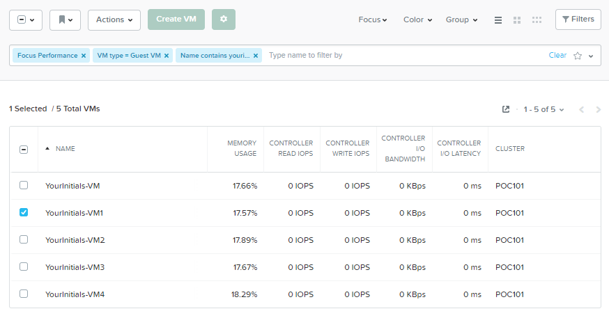

.. _ahvvm:

----------------
AHV VM Workflows
----------------

Overview
++++++++

A quick demo of creating and cloning a VM in Prism highlights ease of use and reinforces the concept of the hypervisor being a feature of the stack, not another datacenter silo that should require tremendous amounts of training to configure and maintain. It is a key part of making Nutanix an on-rem cloud experience.

This demo is performed from the Prism Central interface.

Demo Script
+++++++++++

Begin in **Prism Central > Explore**.

*The Explore view in Prism Central allows us to sort, monitor, and manage all types of entities, including virtual machines.*

Click **Create VM**. Select the AHV cluster and click **OK**.

*Similar to a public cloud experience, you can easily create VMs from pre-built images managed by IT or application developers.*

*Networking in AHV is fully distributed out of the box, making it simple to create and assign new port groups.*

*Similarly, technologies like intelligent VM placement and migration and high availability are enabled out of the box in every AHV deployment. You don't think about HA in the public cloud, and you shouldn't on Nutanix either.*

Fill out the following fields and click **Save**:

- **Name** - *YourInitials-VM*
- **vCPUs** - 2
- **Memory** - 2 GiB
- Select **Add New Disk**

  - **Operation** - Clone from Image Service
  - **Image** - CentOS-7.qcow2
  - Select **Add**
- Select **Add New NIC**

  - **VLAN Name** - isolatedvlan
  - Select **Add**

*The Explorer view makes it simple to drill down and access only the resources we care about.*

Use the search bar to filter for *YourInitials*.

Select your VM and click **Actions > Clone**.

*Because cloning is just an intelligent, metadata operation for the underlying storage we can rapidly provision copies of workloads (running or not) regardless of how small or large a VM is. This is especially helpful when cloning production workloads to use in dev/test or provisioning large pools of virtual desktops.*

Change the **Number of Clones** to **4** and click **Save**.

Select all 5 VMs and click **Actions > Power On**.

Click **Filters** and expand **Hypervisor**, **Health**, **Power State**, and **Memory Usage**.

*We can continue to refine our search for specific entities. You could narrow down VMs by many categories, including cluster, what hypervisor they're running on, power status, performance metrics.*

Click **Filters** to close the sidebar. Click :fa:`star` to save your query.

*And once we've found our target group of entities we can simply save that filtered view to quickly revisit in the future. This allows teams or individuals to easily access the resources and information important to them.*

Click **Focus > Performance**.

*But what about the data associated with these entities, maybe I don't care about their IP Address or Power State but instead want to understand their IO latency and Memory Utilization. By changing the focus we can quickly get to the information we care about. You can also build your own custom focuses by selecting individual metrics.*

Select a single VM and click **Actions > Launch Console**.

*Prism Central also offers self service VM provisioning, management and monitoring to teams and individuals, providing simple IaaS and PaaS back to your business.
