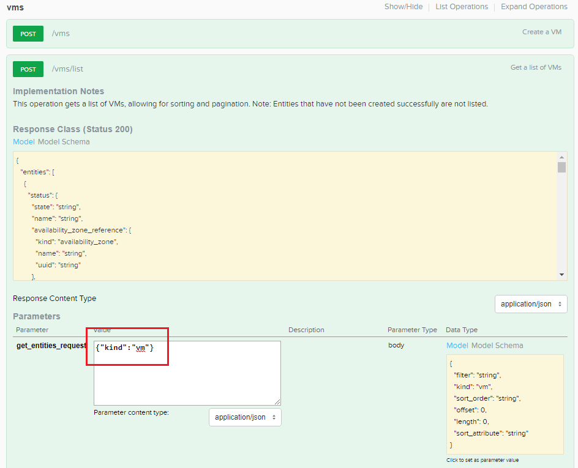
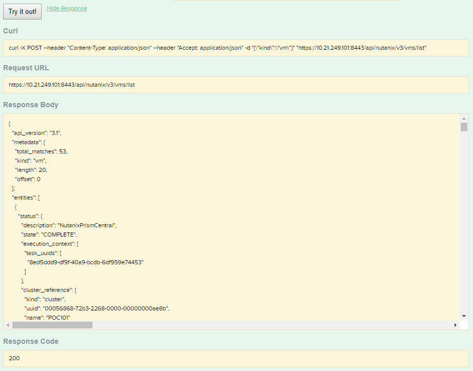
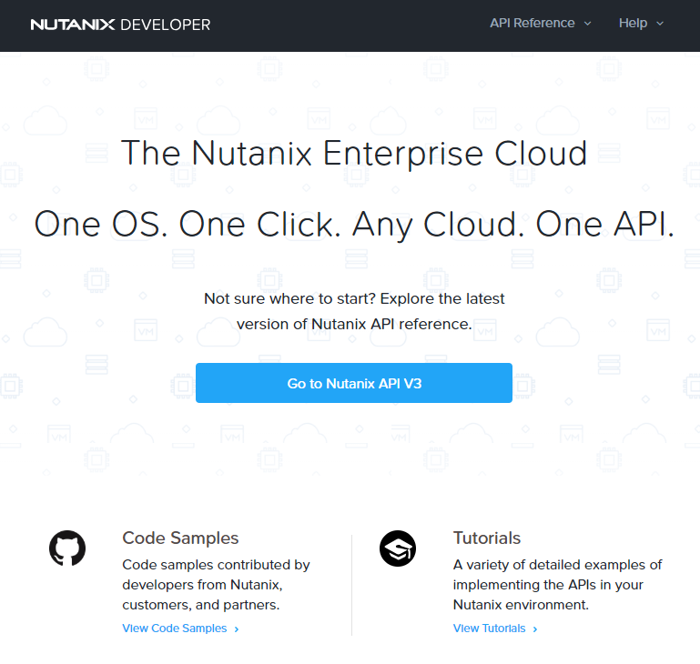

.. _api:

--------------------------
Prism Central API Explorer
--------------------------

Overview
++++++++

A quick demo of the API Explorer can be powerful for the appropriate audience. The standard Prism overview demonstrates that Nutanix management is based on modern web standards and doesn't rely on legacy frameworks (Flash, Java). The API demo shows the prospect's ability to integrate our management with virtually any other workflow or application via REST.

This demo is performed from the Prism Central interface. Triggers for this demo include prospects looking to unify and automate their management tools.

Demo Script
+++++++++++

Begin in **Prism Central**.

From the toolbar, select **Admin > REST API Explorer**.

*The API Explorer is a simple front end to visualizing all of the APIs that Nutanix makes available. All the data displayed or management tasks performed in Prism are driven by these same APIs.*

Select **vms > POST /vms/list**.

*As an example, lets return a list of all of the VMs visible in Prism Central. Here we can see the expected JSON model returned by this API call, an array of VM objects. We'll actually test this API call out by specifying we're looking for "vm" entities, but could pass in additional parameters to sort and filter the response.*

Enter ``{"kind":"vm"}`` into the **get_entities_request** field and click **Try it out!**

*Based on "total_matches" and "length" we have returned the first 20 VM records seen by Prism Central. Using any language or tools that can perform REST calls we could then, as an example, filter that list to identify a specific VM and make an additional API call to update its configuration or power status, or return relevant performance or alert data.*

*If you're interested in learning more about Nutanix APIs I'd encourage you to visit developer.nutanix.com for the complete API reference guide, code samples, and tutorials.*

