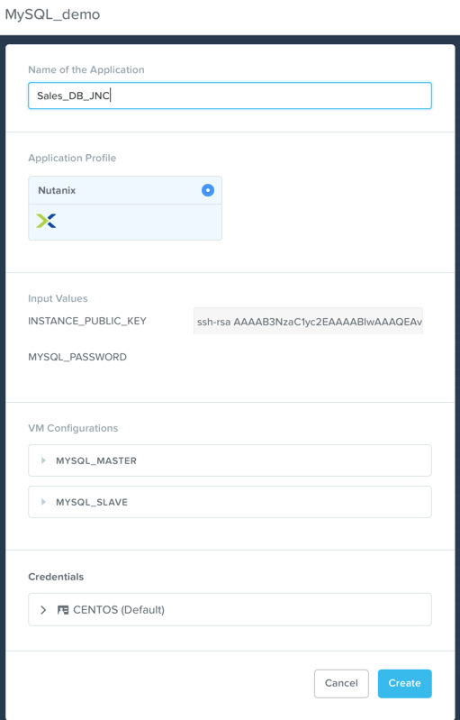
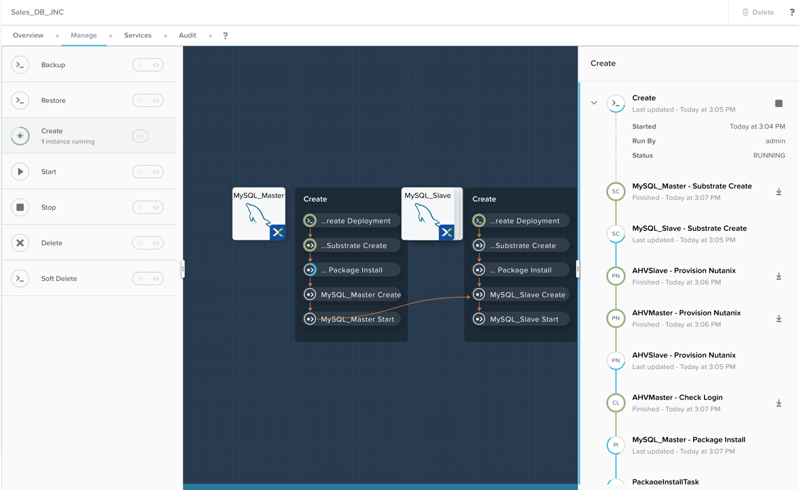

.. _calm:

---------------------------------
Provisioning Blueprints with Calm
---------------------------------

Overview
++++++++

A quick demo of Calm can be powerful for the appropriate audience. By showing how a prospect or customer can automate their Application deployments and lifecycle with Calm in Prism Central further highlights Nutanix's dedication to easy management and operations.

This demo is performed from the Prism Central interface. Triggers for this demo include prospects looking to automate their environments and applications.

Demo Script
+++++++++++

Begin in **Prism Central > Apps**.

*When we first enter the Apps section of Prism Central we see all the running applications deployed with Calm. Now lets have a look at some Blueprints in the Blueprint Explorer.*

Navigate to the Blueprint Explorer, and open the MySQL_demo blueprint.

*Here we can see the MySql blueprint.*

Click on the MySql_Master service and highlight the following:

- **VM** - Where you set the VM(s) configuration

*The VM section is where you can set the VM configuration and image.*

- **Package** - Where you can run Install & Uninstall scripts

*The Package section is where you will do your Install and Uninstall scripts.*

- **Service** - Where you configure the number of Replicas and Service Variables

*The Service section is where you can define the number of replicas, and create any service only variables.*

*Now let's launch the blueprint.*

Next click **Launch** to launch the blueprint.

Fill out the following fields and click **Create**:

- **Name of the Application** - Sales_DB_SEs-Initials

*Now we have launched the blueprint, lets fo see where we can watch the status of the deployment.*

Navigate to the **Manage** tab of the deploying application, and expand the **Create** task.

*You can see the individual tasks that are being done to deploy the application.*

*Lets have a look at a running application.*

Navigate to **Apps > Applications**, and select the running MySqlDemo application.

Highlight the **Overview** page:

*We can see on the Overview dashboard that we have 3 VMs that make up this application. We can see the Blueprint it was created from, as well as which cloud it is running (Nutanix On-Prem, AWS, GCP, or ESXi On-Prem).*

Next highlight the **Manage** page:

*As you can see, the Manage page is where you will manage your application. You can Start and Start your application, or backup and restore it (if that need arises). Also, when it is time to retire this application you will do it here as well.*

*You notice I referred to your Application, not your VMs. Like with the public cloud, and with the business lines, everything to do with management is from the Applications perspective.*

Highlight the **Services** page. Click on each service:

*You can use the Services page to select a service and see the number of replicas, their IPs, and which cloud the service is deployed to.I highlight this, because if you can deploy different services within an Application to different clouds (such as the web servers to the public cloud, and the DB to your local Nutanix cluster).*

Highlight the **Audit** page:

*And finally on the Audit page we can look through the executed tasks and see the output from the individual sub tasks.*

Now take them to the Marketplace, and showcase the many predefined Blueprints they can deploy or clone and edit.

Navigate to Navigate to **Apps > Marketplace**.

*Here in the Marketplace you can have the predefined blueprints, as well as blueprints you publish. This allows you to create a blueprint or an Application, publish it, and allow development teams (or whoever is given access) to launch the blueprint. Very powerful.*

You can also show the **Marketplace Manager** page:

*This is where you can manage the Blueprints available in the Marketplace. You can approve submitted blueprints, as well as publish and un-publish blueprints.*
