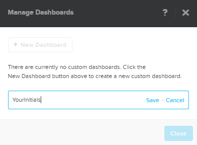
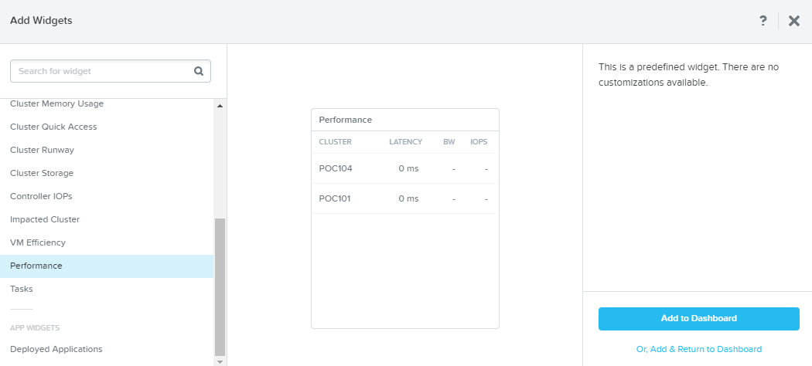
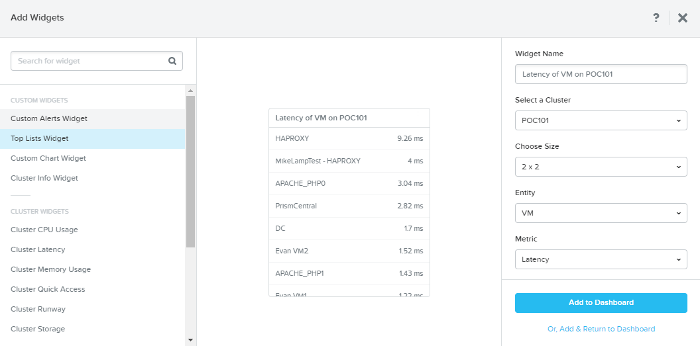
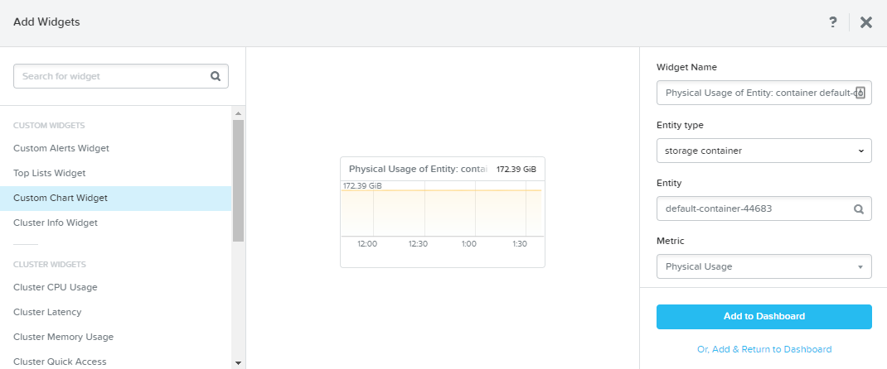

.. _dashboards:

-----------------
Custom Dashboards
-----------------

Overview
++++++++

A quick demo of custom dashboards within Prism Central can highlight the ease of use of Prism and the ability to quickly present relevant information to administrators without having to deploy, learn, and manage complex 3rd party monitoring solutions.

This demo is performed from the Prism Central interface.

Demo Script
+++++++++++

Begin in **Prism Central > Home**.

Click **Manage Dashboards > + New Dashboard**.

Enter a name (e.g. *YourInitials*) and slick **Save**.

Click **Add Widgets**.

Under **Cluster Widgets**, select **Performance** and click **Add to Dashboard**.

Under **Custom Widgets**, select **Top Lists Widget**.

Make the following selections and click **Add to Dashboard**:

- **Select a Cluster** - *Select 1 cluster*
- **Choose Size** - 2x2
- **Entity** - VM
- **Metric** - Latency

Under **Custom Widgets**, select **Custom Chart Widget**.

Make the following selections and click **Add & Return to Dashboard**:

- **Entity Type** - Storage Container
- **Entity** - *Select a default-container*
- **Metric** - Physical Usage

.. figure:: images/5.png
