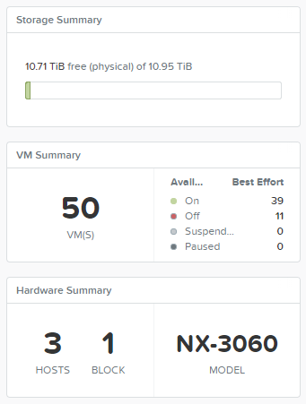
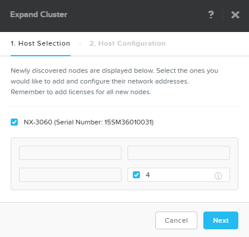
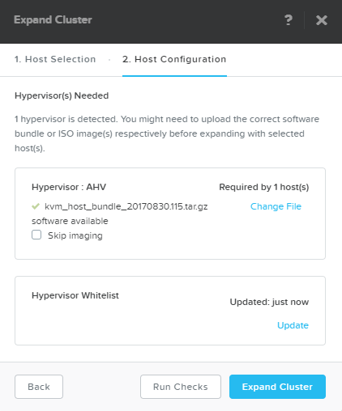
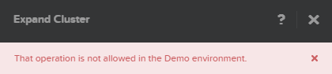

.. _expand:

-----------------
Cluster Expansion
-----------------

Overview
++++++++

Performing a cluster expansion demo provides an opportunity to highlight core architectural benefits of Nutanix with incremental growth, simplified operations with One Click procedure for adding nodes, and platform flexibility, allowing customers to mix node types within a cluster (e.g. storage only nodes & mixing all flash nodes into hybrid clusters).

This demo is performed from the Prism Element interface of an individual cluster. Triggers for this demo include prospects who are on legacy 3 tier platforms today and have had issues with over-buying and difficulty scaling their environments. This demo can also be used to set traps for other HCI vendors who lack Nutanix's ability to scale and flexibility regarding heterogeneous clusters.

On the Demo site you are restricted from completing the cluster expansion workflow. If you wish to show an example of the entire end to end process and do not have a dedicated cluster available, use the following pre-recorded example:

.. raw:: html

  <iframe width="640" height="360" src="https://www.youtube.com/embed/qUvErKsLPYk?rel=0&amp;showinfo=0&amp;vq=hd1080" frameborder="0" allow="autoplay; encrypted-media" allowfullscreen></iframe>

Demo Script
+++++++++++

Begin in **Prism Element > Home**.

*We see the selected cluster is comprised of 3 nodes with a total storage capacity of approximately 11TB.*

*Once new Nutanix nodes have been racked, cabled, and powered on, they're ready to be discovered in Prism. To begin the process we click Expand Cluster.*

From **Prism Element**, click :fa:`cog` **> Expand Cluster**.

*All NX and OEM nodes ship from the factory running AHV and a Nutanix Controller VM. Controller VMs not belonging to a cluster perform a link-local broadcast for easy discovery. Here we see an additional node has been discovered.*

.. note::

  *Nutanix has an automated process called Foundation that can be used to stage bare metal nodes.*

Select the discovered Node, and scroll down to show the **Controller VM, Hypervisor, and IPMI IP** fields.

*Each node requires 3 IP address assignments, 1 each for hypervisor, Controller VM, and out of band management. In this case the fields are pre-populated as this node has previously been joined and removed from this cluster.*

Click **Next**.

*The node(s) you may be adding to a cluster may not match the hypervisor or Nutanix AOS software versions of the cluster. If the expansion wizard detects a difference in hypervisor or AOS version, the nodes can be automatically re-imaged prior to joining the cluster.*

*To complete the process, you would click the Expand Cluster button. This would result in the cluster expanding from 3 to 4 nodes, making the additional storage immediately available to all Storage Containers. As an automatic background operation we would begin balancing storage utilization across the newly expanded cluster. For AHV environments, the additional compute capacity would be available to running workloads, and Acropolis Dynamic Scheduling (ADS) would begin live migrating workloads to achieve optimal performance. In a vSphere environment, the Storage Container(s) would be mapped to the new node as Datastore(s) and once the host is added to the vSphere cluster, DRS would be able to begin moving workloads to the new host.*

*Post physical deployment, growing a Nutanix cluster by 1 or many nodes is just a few clicks. Even in the case of re-imaging to a completely different hypervisor, your new nodes are contributing resources within an hour. The process is the same regardless of number of nodes, and Nutanix offers the greatest scalability in the hyperconverged market.*

*Not only does Nutanix make the expansion process simple, we also provide the greatest flexibility when it comes to heterogenous clusters. Nutanix supports mixing different generations of hardware, vastly different node configurations (e.g. mixing hybrid and all flash), and the ability to add Storage Only nodes to grow cluster storage capacity. Storage Only nodes save 3rd party hypervisor licensing costs by running AHV.*

Do not click **Expand Cluster**. Close the **Expand Cluster** dialog.

