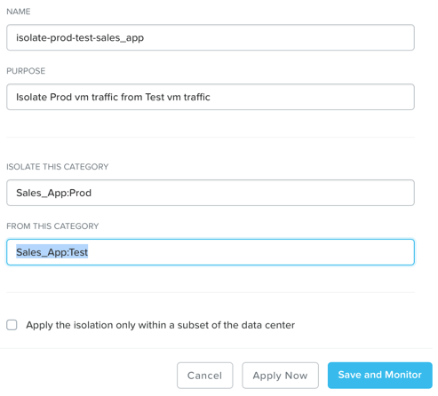

.. _flowisolation:

--------------------------------
Isolating Environments with Flow
--------------------------------

Overview
++++++++

A quick demo of the Flow Isolation Policies can be powerful for the appropriate audience. The easy ability to show how to setup Categories, Isolation Polices, and applying them both to VM(s) is highlights Nutanix's commitment to easy management and operations.

This demo is performed from the Prism Central interface. Triggers for this demo include prospects looking to secure their VMs (possibly own or looking at NSX or ACI).

Demo Script
+++++++++++

Begin in **Prism Central > Explore > Categories**.

*When you want to group VMs together, such as by application type, you will create a Category. Lets create a Category for our Sales Application, and add values for Production and Test.*

Click **New Category**. Give the Category a name (Such as Sales App) and Purpose. Then Add at least 2 values (such as Prod and Test) and click **Save**.

Fill out the following fields and click **Save**:

- **Name** - Sales_App
- **Purpose** - This category will be used to tag VMs belonging to the Sales Application, as an example. This category will have “Prod” and “Test” values in order to differentiate Prod and Test VMs within the Sales App category
- **Values** - Prod
- **Values** - Test

*Now that we have created a Category for our Sales Application, we can create a Security Policy.*

Navigate to **Explore > Security Policies**, and click **Create Security Policy > Isolate Environments**.

Fill out the following fields and click **Apply Now**:

- **Name** - isolate-prod-test-sales_app
- **Purpose** - Isolate Prod vm traffic from Test vm traffic
- **Isolate This Category** - Sales_App:Prod
- **From This Category** - Sales_App:Test

Do NOT select the check box for **Apply the isolation only within a subset of the data center**.

.. note::
  The Save and Monitor button allows you to save the configuration and monitor how the security policy works without applying it.

*Now we have configured our Isolation Security Policy, we can add the VMs we do not want to allow communication.*

Navigate to **Explore > VMs**

Pick two VMs, and assign them the Sales_App Category.

*Now we can pick two VMs that we want to isolate from each other, and assign them to the Sales_App Categories for Prod and Test.*

Open the VM console of the two VMs by selecting one VM at a time then clicking on the checkbox next to it.

Click **Actions > Launch Console**.

Log into both VMs and find the IPs of the VMs.

*Pings should succeed because these two VMs do not yet have categories assigned.*

Navigate to **Explore > VMs**.

Select **VM1** and click **Actions > Manage Categories**.

In the Set Categories text box on the left side of the UI, type Prod and select **Sales_App:Prod** from autocomplete. Click Save.

Select **VM2** and click **Actions > Manage Categories**.

In the Set Categories text box on the left side of the UI, type Test and select **Sales_App:Test** from autocomplete. Click Save.

*Now we have assigned the Categories we created earlier to these two VMs. Now lets see if they can communicate with each other.*

Open the VM console of **VM1** and **VM2*.

Log into both VMs and ping from the **fVM1** VM to the **VM2** VM.

*Pings do NOT succeed because these two VMs now belong to the Sales_App:Prod and Sales_App:Test categories and the policy isolate-interns-sales-abc, which was created earlier, isolates these two types of VMs.
