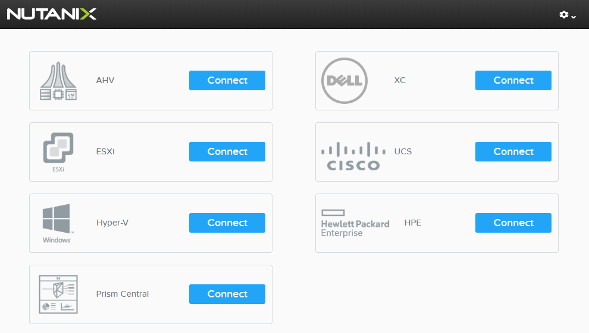

.. title:: Delivering Nutanix Demos

.. toctree::
  :maxdepth: 2
  :caption: Starting Point
  :name: _start
  :hidden:

  overview/overview

.. toctree::
  :maxdepth: 2
  :caption: Prism Central Demos
  :name: _pc
  :hidden:

  dashboards/dashboards
..  capacityplanning/capacityplanning
  ahvvm/ahvvm
..  esxicrud/esxicrud
  flowisolation/flowisolation
  calm/calm
  api/api

.. toctree::
  :maxdepth: 2
  :caption: Prism Element Demos
  :name: _pe
  :hidden:

  expand/expand
  upgrade/upgrade
  storage/storage
  protectiondomains/protectiondomains

.. _getting_started:

---------------
Getting Started
---------------

This Workshop contains multiple examples of Nutanix demos that can be delivered via the Nutanix Demos on Demand site.

**The materials provided in this Workshop are designed to work as a guide for assisting new Nutanix sellers develop familiarity with Nutanix demo techniques. It is not an exhaustive guide, nor does it represent the ONLY way to demo Nutanix features and value.**

The Nutanix Demo site can be accessed by Nutanix Employees and Partners at https://demo.nutanix.com. Use your **my.nutanix.com** credentials to login. No VPN is required.

The site provides the ability to deliver **non-destructive** Prism demos at any time.

Currently the Demo site provides shared access to 6 Nutanix clusters:

- 1x NX Cluster running AHV (registered with Prism Central)
- 1x NX Cluster running ESXi (registered with Prism Central)
- 1x NX Cluster running Hyper-V
- 1x Dell XC Cluster running ESXi
- 1x Cisco UCS Cluster running AHV
- 1x HPE Cluster running AHV

What's New
++++++++++

Initial revision based on the PC 5.6/AOS 5.6 demo site with examples of the following:

- Dashboard Overview
- Custom Dashboards
- Cluster Expansion
- One Click Upgrades
- Storage Container Provisioning
- VM Creation and Cloning
- ESXi CRUD Management
- Prism Pro Capacity Planning
- Protecting VMs
- Isolating VMs with Flow
- Calm
- Prism Central API Explorer

Restrictions
++++++++++++

As the Demo site is a shared environment being used by multiple users simultaneously, there are certain restrictions on actions you are able to perform, including but not limited to:

- Fully executing a cluster expand operation
- Fully executing a One Click upgrade operation
- Removing a node from the cluster
- Node power operations
- Modifying cluster info (name, IPs, Prism banner settings, etc.)
- Modifying the default Prism Central project or Calm Blueprints
- Deleting VMs/Networks/Protection Domains/etc.
- Accessing vCenter/SCVMM
- Large cloning operations (currently limited to 15 clones in a single operation)

Additionally, VMs, Networks, Protection Domains, etc. created during demos are deleted within 15 minutes of your session expiring.

Due to these restrictions, the Demo site is not an ideal platform for delivering in depth Workload focused demos that would require prior staging (e.g. Citrix, Splunk, X-Ray, etc.). For advanced demo requirements, please reserve a Nutanix Hosted POC cluster.

Best Practices
++++++++++++++

Know your audience! Slamming a prospect's existing storage in front of a storage administrator is generally a bad idea.

Demos are not training or complete explanations of how to administrate the platform, the goal is to highlight platform value (ease of use, flexibility, benefits of a fully integrated stack, etc.) as it relates to customer pain points or business objectives.

A typical quick product demo at the end of a 1st or 2nd meeting with a prospect should only focus on the top 2-3 feature areas you feel best highlight Nutanix value in that situation. Do not attempt to demo every feature detailed in this Workshop.

Be cautious of frequently hopping back and forth between Prism Central and Prism Element.

The Demo launch page gives you an additional opportunity to speak to hypervisor and hardware choice prior to beginning the Prism demo.

On the Demo launch page, clicking :fa:`cog` **> Configure View** allows you to hide hypervisor/hardware options. This can be helpful when you're brought into a meeting by a particular OEM and choose to hide certain platform options as a courtesy.

If presenting on a projector, consider increasing the contrast within Prism to make the demo more easily visible. To adjust contrast, hold the Shift key and click **Admin > Adjust Contrast > High** from the Prism toolbar. This feature is only supported in Google Chrome.
