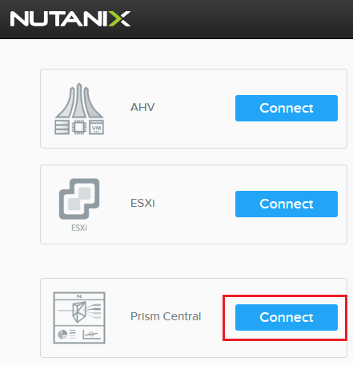
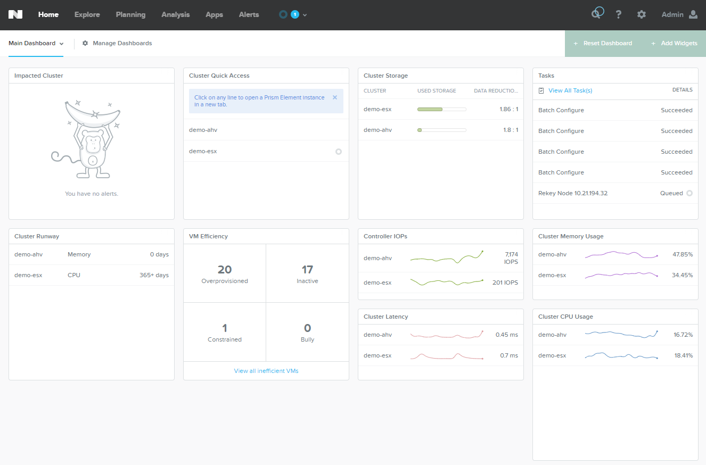
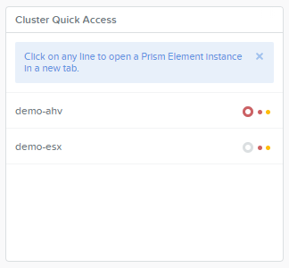
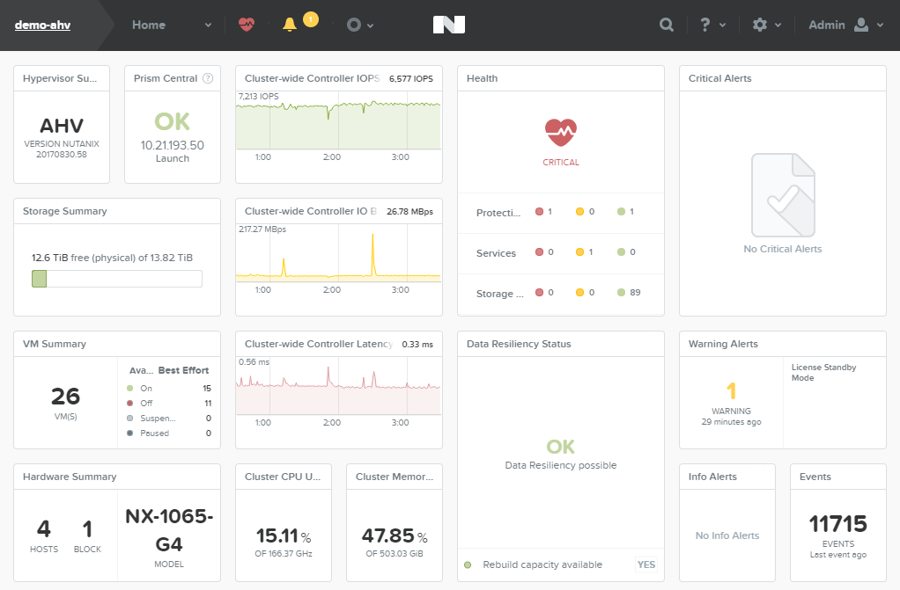

--------------
Prism Overview
--------------

Overview
++++++++

Beginning a demo with an overview of Prism Central and Prism Element dashboards requires no creation of new entities and serves as the ideal launch pad for talking about other features.

Demo Script
+++++++++++

Prior the beginning the Prism demo, the Demo site launch page provides an opportunity to speak to the freedom of choice offered by the Nutanix platform. In addition to providing a full stack, appliance experience with Nutanix AHV and our NX hardware, the customer also has the ability to run our software on VMware ESXi, Microsoft Hyper-V and Citrix XenServer, using hardware from leading vendors like Dell, Lenovo, IBM, HPE, Cisco, and additional specalialty platforms like Crystal and Klas.

.. note::

  If presenting on a projector, consider increasing the contrast within Prism to make the demo more easily visible. To adjust contrast, hold the Shift key and click **Admin > Adjust Contrast > High** from the Prism toolbar. This feature is only supported in Google Chrome.

From the Demo site launch page, **Connect** to **Prism Central**.

*Prism Central is the unified management interface for managing multiple Nutanix clusters, regardless of underlying hardware platform or hypervisor. Prism Central can be both deployed and upgraded as part of a simple One Click operation. Prism Central is deployed as a scale out virtual appliance, meaning it is highly available "out of the box" with no additional databases or middleware to configure or maintain. The interface is 100% HTML5, meaning it is accessible from any modern browser or any platform, without the need to install and maintain legacy runtimes like Flash or Java. Additionally, everything we'll show you today in the Prism UI is exposed through Nutanix's RESTful API, which enables integration between Nutanix management and many 3rd party tools.*

*The Home page provides important details about the operations of all Nutanix resources through a pre-defined dashboard. We can see by default you're given immediate insights into cluster resource utilization, alerting, and recent tasks.*

*We are also provided high level insights from Prism Central's machine learning capabilities regarding VM Efficiency and runway timelines for critical cluster resources including CPU, Memory, and Storage Capacity.*

*Customizable dashboards can be easily created to monitor the status, health, and performance of entities important to you and your teams.*

From this point you can now steer the demo in a number of different directions within Prism Central, including:

- :ref:`dashboards`
- :ref:`ahvvm`
- :ref:`capacityplanning`
- :ref:`calm`
- :ref:`api`

Continue with this guide to log into an individual cluster in order to demo Prism Element functionality.

*From Prism Central we can narrow our focus to the operations specific to an individual Nutanix cluster. The management UI for the individual cluster, called Prism Element, can be launched directly from out Prism Central Home view, simply by clicking the desired cluster from the Cluster Quick Access widget.*

Click a cluster from the **Cluster Quick Access** widget.

*Prism Element will open in a new tab, automatically authenticated by Prism Central. Prism can be easily integrated with your existing Active Directory to provide access to Users and Security Groups.*

*Once logged in, we are presented with a similar dashboard, summarizing the key metrics for the individual cluster, including hypervisor, cluster size, resource utilization, peformance, and health. No complicated reports or dashboards to build, Prism provides immediate visibility to the critical information a systems administrator would want at their fingertips.*

From this point you can now steer the demo in a number of different directions within Prism Element, including:

- :ref:`expand`
- :ref:`upgrade`
- :ref:`protectiondomains`
- :ref:`storage`
