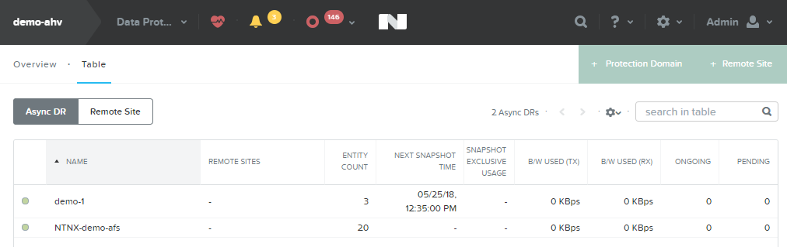
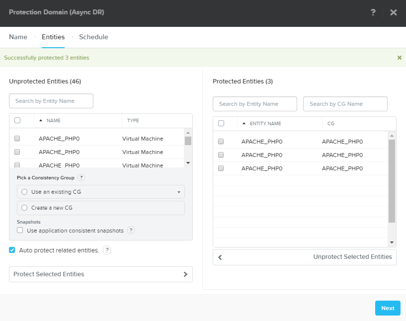
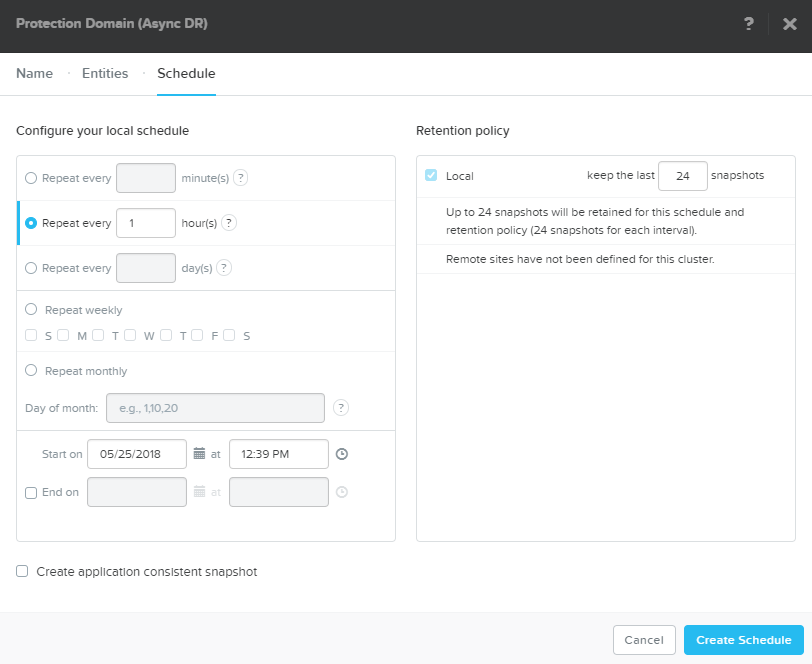
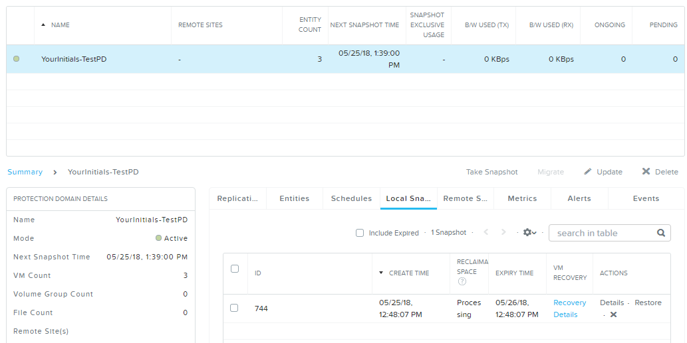
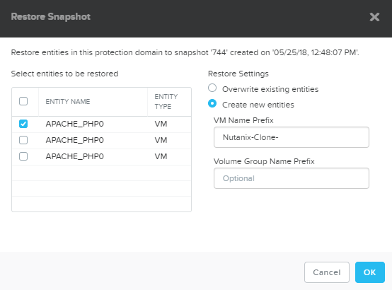

.. _protectiondomains:

--------------
Protecting VMs
--------------

Overview
++++++++

Demoing Protection Domains provides opportunities to highlight operational simplicity within Prism, the benefits of a VM-aware storage platform, and the overall maturity of the Nutanix stack with support for technologies like near-sync replication and Metro Availability. It is also an opportunity to highlight the vision of Xi and Disaster Recovery as a Service.

This demo is performed from the Prism Element interface of an individual cluster. Triggers for this demo include prospects who experience virtualization and storage silos pain, snapshot performance degradation pain, or lack adequate business continuity solutions.

Demo Script
+++++++++++

Begin in **Prism Element > Data Protection > Table**.

*Regardless of underlying hypervisor, Nutanix provides native VM level snapshotting and replication. Snapshots can be replicated to remote Nutanix clusters or directly to AWS or Azure for offsite backup. Asyncronous snapshots can be performed as often as 1 minute for a near-sync RPO, and we also support synchronous replication between clusters for applications with aggressive RPO SLAs. *

.. note::

  *For your vSphere environment we provide a certified SRA plugin for VMware Site Recovery Manager, allowing Nutanix storage level snapshots to integrate into your DR runbooks.

Click **+ Protection Domain > Async DR**.

Enter a **Name** (e.g. *YourInitials-TestPD*) and click **Create**.

*Protecting new VMs is as simple as selecting the individual VMs we'd like to protect, clicking protect, and assigning a schedule.*

Select 1 or more VMs, click **Protect Selected Entities** and click **Next**.

Click **New Schedule**.

*Here we'll configure an hourly snapshot schedule where we retain the last 24 hours worth of snapshots. Multiple schedules can be configured for each group of VMs to meet daily, weekly, or monthly retention requirements.*

Under **Configure your local schedule**, Select **Repeat every \_\_ hours** and enter **1**.

*In this environment we're only storing snapshots locally, but if remote Nutanix clusters were configured, replicating to those sites is as simple as checking a box and defining how many snapshots I wish to retain at each site. Native replication provides policies for throttling bandwidth and compression on the wire, and will always intelligently seed only unique data to the remote site.*

Under **Retention policy**, change **Keep the last \_\_ snapshots** to **24**.

Click **Create Schedule**. Click **Close**.

Select your Protection Domain from the table and select the **Local Snapshots** tab in the table below.

*We see the initial snapshot has already been taken. Within 2 minutes we've ensured the protection of our workloads. With upcoming solutions like Xi and native DR runbooks, Nutanix will offer an end to end business continuity solution with the same One Click simplicity.*

Under **Actions**, click **Restore**.

*Restoring the previous state of one or many VMs to a clone is a simple metadata operation and can be performed rapidly, regardless of size of VM.*
