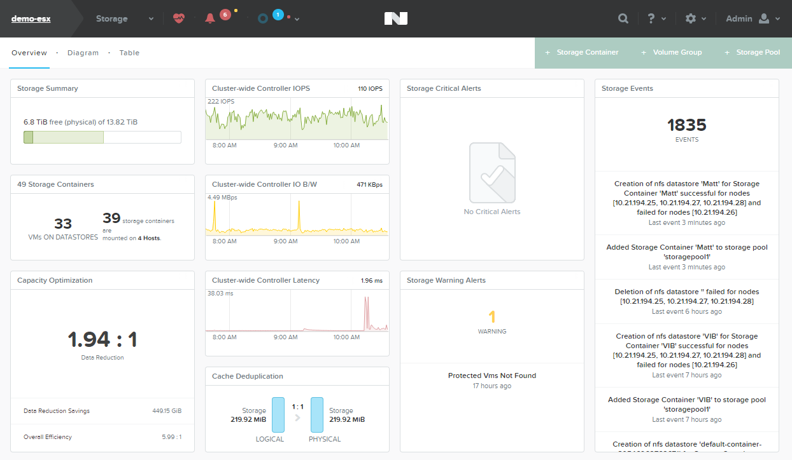
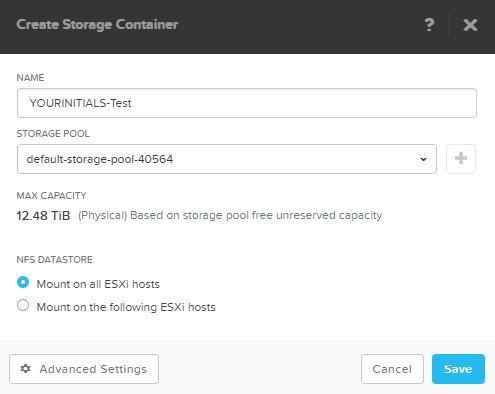
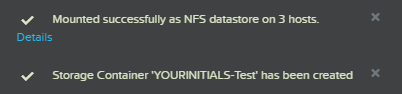

.. _storage:

----------------
Managing Storage
----------------

Overview
++++++++

Creating a Storage Container provides the opportunity to highlight simplified operations with Nutanix. It also gives you the ability to reaffirm our capabilities around "tablestakes" functionality like compression and deduplication.

This demo is performed from the Prism Element interface of an individual cluster. This demo is typically most impactful for virtualization or application administrators who struggle to get access to storage resources for expansion or new projects.

Demo Script
+++++++++++

Begin in **Prism Element > Storage**.

*Moving to managing storage for the cluster, we are presented with a familiar dashboard view. This dashboard is more narrowly focused on storage operations, including storage related alerts and overall data efficiency for the cluster.*

Click **Table**.

*The two main storage concepts in a Nutanix environment are the Storage Pool and Storage Containers. The Storage Pool is simply the aggregation of all of the phyiscal disks within a cluster. Unlike traditional storage there is no need to manually divide resources into volumes, meaning Nutanix can manage and actively take advantage of all capacity and performance resources available. Storage Containers are how storage is presented to the hypervisor. Each is a thin provisioned, logical container that can utilize all the resources of the underlying Storage Pool. In the vSphere world, each container is presented to your ESXi hosts as a datastore. Let's look at how quickly storage can be made available.*

Click **+ Storage Container**.

Provide a **Name** (e.g. *YOURINITIALS-Test*) and click **Save**.

*In 3 clicks and less than 30 seconds, we can provision new datastores that will be automatically mounted to each of your hosts in the cluster. It's typical in a Nutanix environment to only have a single storage container, so let's take a quick look at why you may create multiple containers.*

Select your Storage Container from the table and click **Update**.

Click **Advanced Settings** and scroll down.

*The Advanced Settings allow you to do things like enabling or disabling data efficiency features such as compression, deduplication, and erasure coding. While Nutanix excels in each of these areas, certain workloads may not be an optimal fit for a particular space saving feature. For instance, you may have a pool of non-persistent virtual desktops sharing a single golden image and refreshing daily - you wouldn't expect to see any savings from deduplication, so those desktops are provisioned to a datastore without deduplication. You may also have a pool of full clone persistent desktops that would benefit greatly from deduplication. Additionally you can create reservations of storage capacity for applications that require capacity guarantees or present datastores that only show a subset of available storage. Quick and easy to deploy, but with the flexibility required by real life workloads.*
