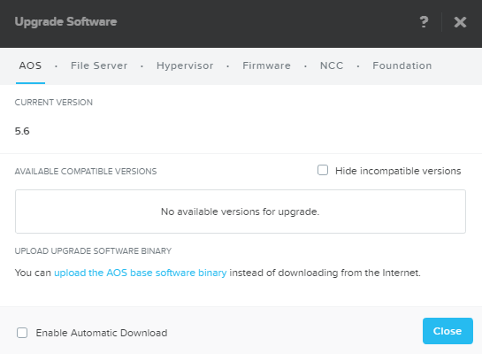
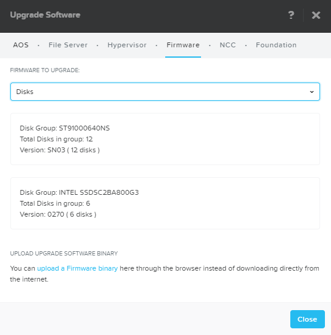

.. _upgrade:

------------------
One Click Upgrades
------------------

Overview
++++++++

Performing a One Click Upgrade demo provides the opportunity to highlight simplified and automated operations with Nutanix, and also to highlight the maturity of the solution. Nutanix takes a full stack approach, where its not enough to provide customer delight around updating our software features, we also need to address things like 3rd party hypervisors and device firmware. The other critical value not to overlook in discussing One Click upgrades is the ability to quickly and easily take advantage of new platform enhancements.

This demo is performed from the Prism Element interface of an individual cluster. Triggers for this demo can include prospects on legacy, non-SDS storage platforms, or platforms with difficult and time consuming upgrade paths like vBlocks, or even vSphere.

On the Demo site you are restricted from executing a One Click upgrade workflow. If you wish to show an example of the entire end to end process and do not have a dedicated cluster available, use the following pre-recorded example:

.. raw:: html

  <iframe width="640" height="360" src="https://www.youtube.com/embed/_dzyaWbRkAQ?rel=0&amp;showinfo=0&amp;vq=hd1080" frameborder="0" allow="autoplay; encrypted-media" allowfullscreen></iframe>

Demo Script
+++++++++++

Begin in **Prism Element > Home**.

From **Prism Element**, click :fa:`cog` **> Upgrade Software**.

*With a single click to download an available software update, and an additional click to start the upgrade process, Nutanix provides a fully automated and non-disruptive means of updating our software. AOS upgrades involve no live migration of workloads and zero host reboots. One of the primary benefits of our software defined stack is constant improvement to your investment. Traditional storage platforms see primarily just fixes during their lifecycle, but new AOS versions could contain fixes plus significant new features and performance enhancements. Being able to easily apply those upgrades provides a more cloud-like experience. Based on our reverse roadmap we can also show you how Nutanix has consistently delivered on its vision of the Enterprise Cloud.*

Select the **Hypervisor** or **Firmware** tab.

*Moving to the other software upgrade tabs, we see our focus isn't simply to manage our storage stack. Nutanix is a datacenter operating system, with One Click operational simplicity at every stage. We provide automated, non-disruptive upgrades for device firmware, our health checks, and even third party hypervisors, removing the need to manually remediate host upgrades with products like VMware Upgrade Manager.*

*Our commitment to automation reduces downtime and gives back time to systems administrators to focus on strategic work that more directly supports your business.*
